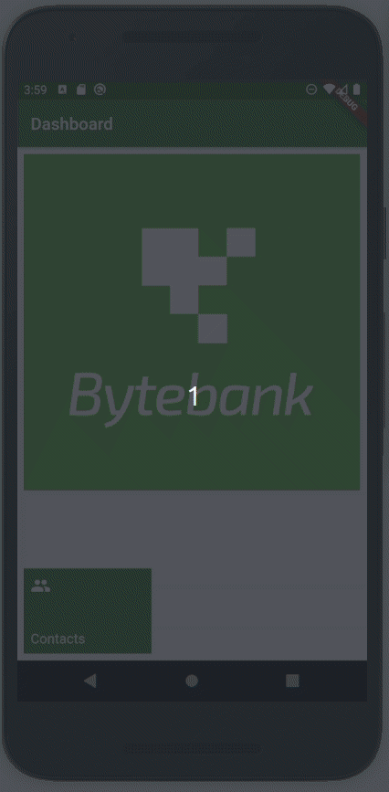
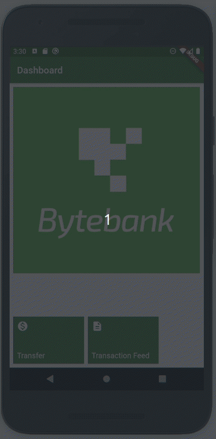

# ByteBank

Projeto simples de exemplo de uso do Flutter com persistencia de dados internos (sqflite).

Módulos utilizados:

* [sqflite](https://pub.dev/packages/sqflite)
* [path](https://pub.dev/packages/path)
* [http](https://pub.dev/packages/http)
* [http interceptor](https://pub.dev/packages/http_interceptor) 

Versão 1: Utiliza persistencia de dados internos (sqflite). 

Versão 2: Utiliza persistencia de dados internos (sqflite) e uma Web API. 
